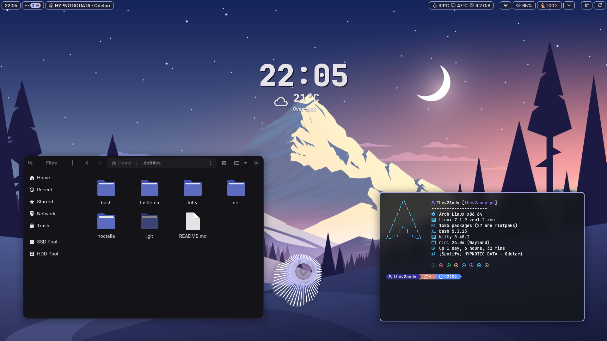
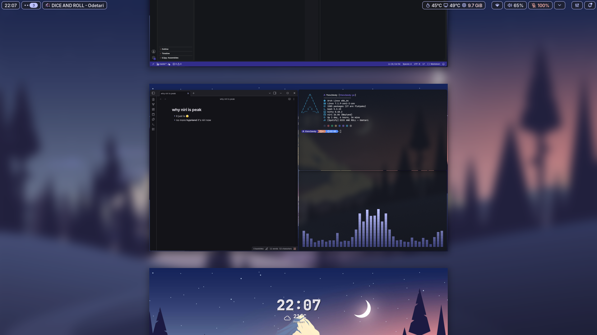
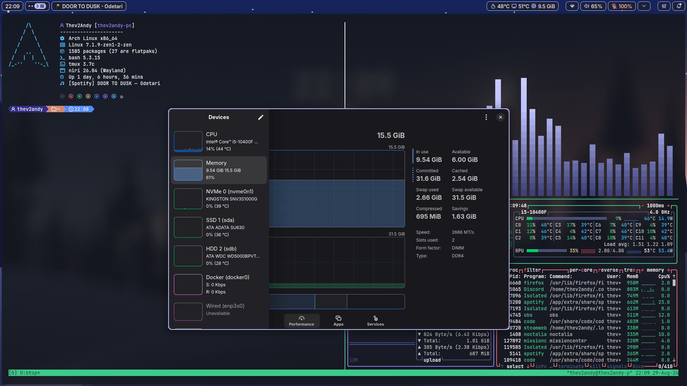
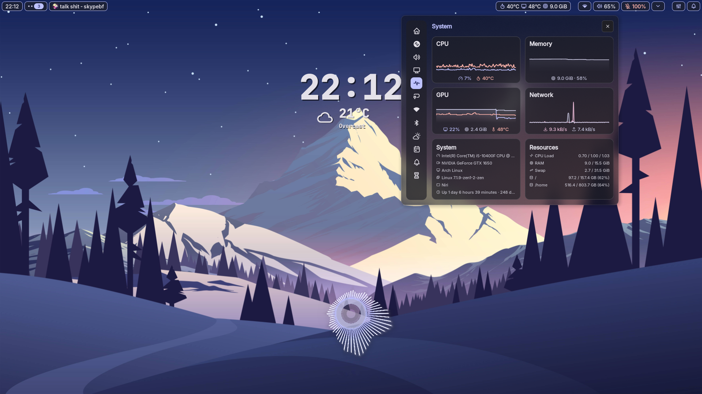
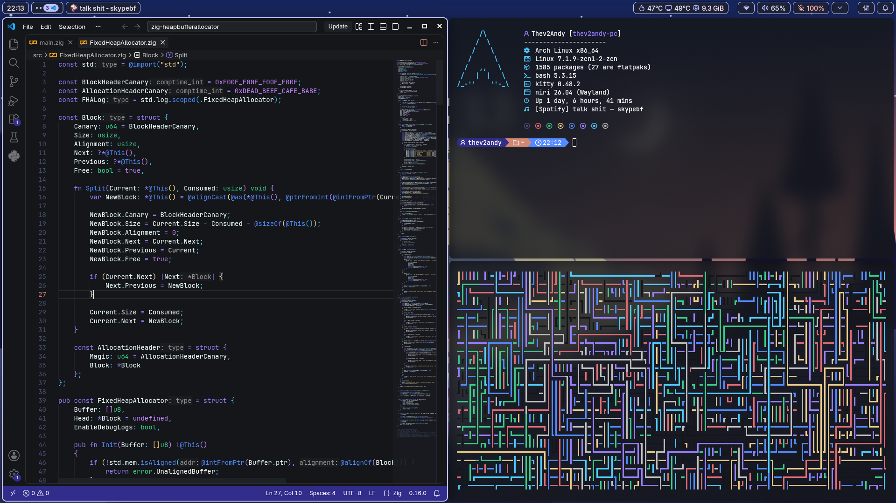
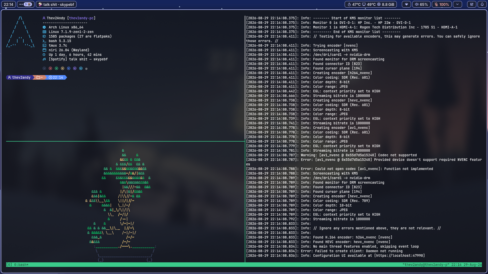

<div align="center">
<h1> dotfiles</h1>
My personal daily driver setup running on <b>Arch Linux</b>.<br/>
(<i>i use arch btw🥀💔</i>)<br/>
dotfiles are distro-agnostic fyi
</div>

## Screenshots
<table>
  <tr>
    <td width="50%"></td>
    <td width="50%"></td>
  </tr>
  <tr>
    <td width="50%"></td>
    <td width="50%"></td>
  </tr>
  <tr>
    <td width="50%"></td>
    <td width="50%"></td>
  </tr>
</table>

## Included
- Modular `.bashrc` with dynamic script loading
- Kitty configuration with included theme
- Modular niri configuration
- Noctalia configuration (may require GUI override adjustments for different monitors)
- Oh-My-Posh prompt configuration

## **NOT** Included
- Wallpapers
- Fonts
- VSCode Theme (shameless plug: [future-dark-vscode](https://github.com/Thev2Andy/future-dark-vscode))

## Dependencies
- Niri, Noctalia, Bash (_obviously.._)
- Fonts: JetBrainsMono Nerd Font, Inter Font
- Integrated but optional: `fastfetch`, `oh-my-posh`, `bat`
- Spawned at startup: `easyeffects`, `oniri`, `wayland-pipewire-idle-inhibit`

## Applications
By default, the following apps are used for binds: Kitty (`kitty`), Nautilus (`nautilus --new-window`), Firefox (`firefox`), VSCode (`code`), OBS Studio (with `obs-cmd`).<br/>
However, they are abstracted by a bash script inside niri's configuration, such that they can be overridden in an `apps.json` file dropped in `~/.config/niri`, like this:
```json
{
    "terminal": "kitty",
    "files": "nautilus --new-window",
    "browser": "firefox",
    "editor": "code",
    "ipc-instant-replay": "obs-cmd replay save"
}
```
It is also possible to add your own keys to `apps.json`, however invoking them with no configuration file present will have no defaults.
```bash
./launch-app.sh custom-valid
# executes key 'custom-valid' from apps.json

./launch-app.sh custom-invalid
ERROR: Unknown app: custom-invalid
```

## Cloning & Setup
clone the repo and stow the packages gang it genuinely can't be that hard😭🙏
```bash
cd ~
git clone https://github.com/Thev2Andy/dotfiles.git .dotfiles
cd .dotfiles
for d in */; do stow -t ~ "${d%/}"; done
```
\* Requires GNU stow (`stow`)<br/>

___

"_i have dotglobbing enabled, your stow command put `.git` and `.git-assets` into my home folder_"<br/>
<br/>
(hover the image)

### Unstowing accidentaly stowed hidden folders
```bash
for d in .*/; do stow -D -t ~ "${d%/}"; done
```
fyi ironically enough if you know how to modify your globbing settings you should know how to run stow on packages but that's just me tbh🥀 maybe read a manpage or two😭🙏💔